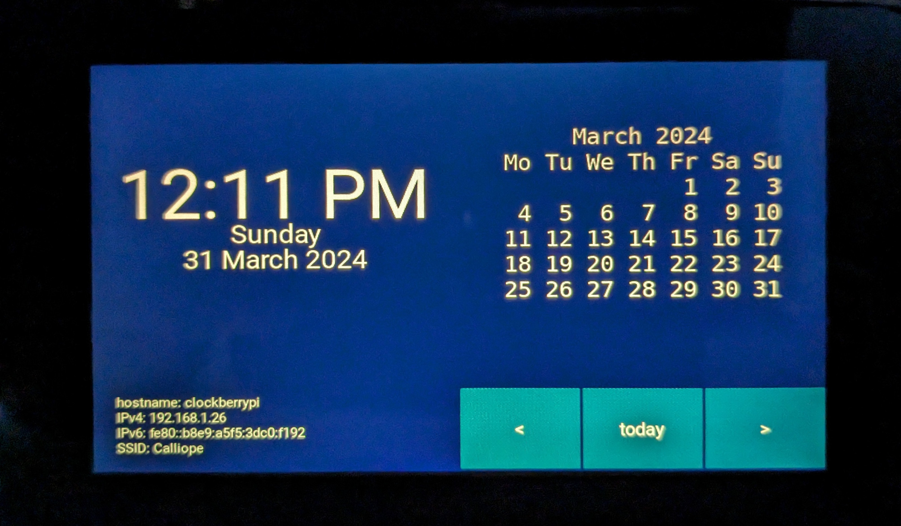

# ClockberryPi (Desk Clock)

Raspberry Pi Model 3B + Touch Screen turned into a desktop clock. 
Or, run it as a window on your computer.



Colors are off in the above picture, and it's not actually a blue background. 
That's just an artifact of the picture I didn't take the time to fix in 
post-processing.

## Python Packages

If you're not running this on a dedicated device, you will probably want a
virtualenv.

```shell
python -m venv .venv
source .venv/bin/activate
```
To install the python dependencies:

```shell
pip install -r requirements.txt
```

## Raspberry Pi OS Lite dependencies

```shell
sudo ./rpi-os-lite-installs.sh
```

## Systemd service

To have desk clock start at boot, install it as a user-level systemd service.

```shell
./install-as-service.sh
```

NOTE: The service file assumes it's running deskclock from 
`/home/pi/clockberrypi`. If you're running from a different directory, modify 
`deskclock.service` accordingly.

## "MESA-LOADER: failed to open iris" Error

You don't need this on a Raspberry Pi. But you may on an Intel Ubuntu box.

```shell
export LD_PRELOAD=/usr/lib/x86_64-linux-gnu/libstdc++.so.6
```